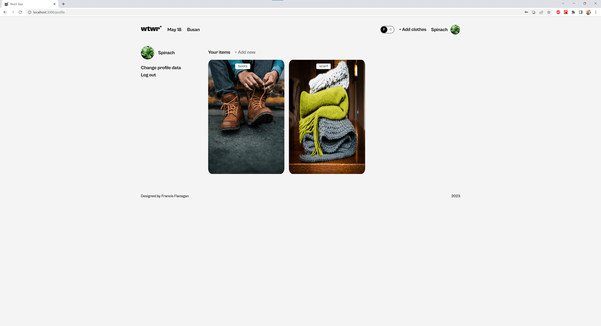
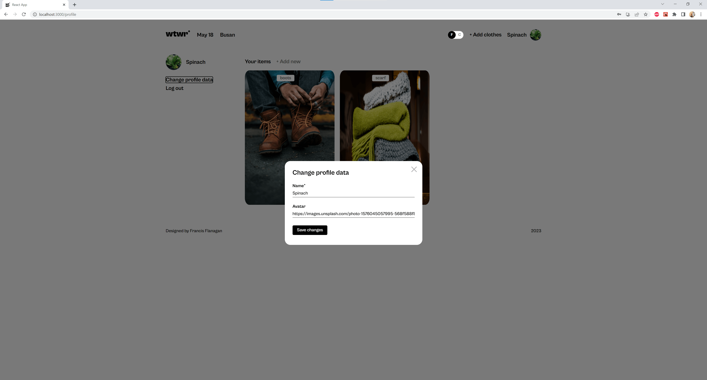

# WTWR (What to Wear?)

## About the project

This project is the eleventh project in Practicum's Software Engineering course. It is the second iteration of a project that will span several sprints. Here I add API calls to a mock server to allow the adding and deleting of clothing cards to the page. When the page is first rendered, an API call is made to get the clothing cards from the database based on the temperature. Routes have also been added, one for the main page and one for the profile page. When clicking on the profile name or profile avatar, the `<Profile>` component is rendered. Lastly, a `<ToggleSwitch>` component was added to allow users to switch between Celsius and Fahrenheit that when clicked will update the state of the current temperature unit. The temperature value will then update anywhere on the page where it is used.

## Technologies and Techniques

- Semantic HTML
- CSS flexbox
- React Functional Components
- API requests
- Webpack

## Future Plans

I will continue to update this project over the coming sprints. Functionality to add clothing cards and possibly like clothing cards will be added. I would also like to add form validation and for the weather card to dynamically change depending on the weather.

## Preview

## Links

- [Figma Design](https://www.figma.com/file/DTojSwldenF9UPKQZd6RRb/Sprint-10%3A-WTWR)
