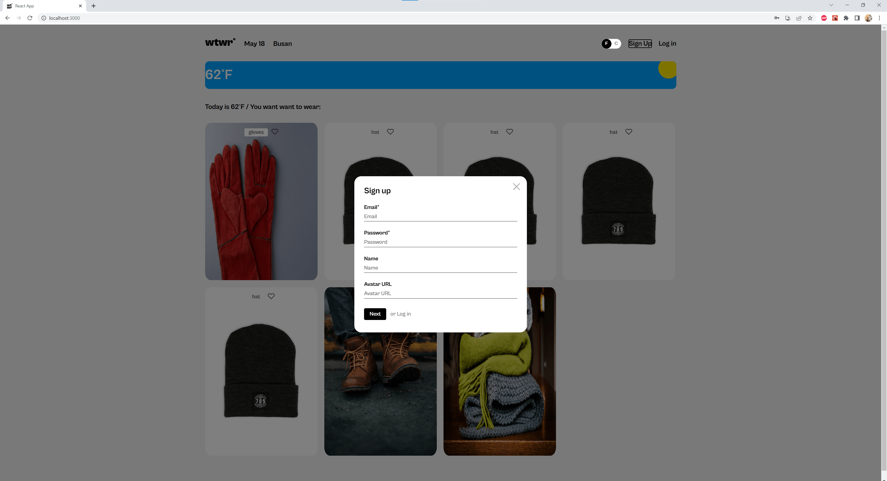
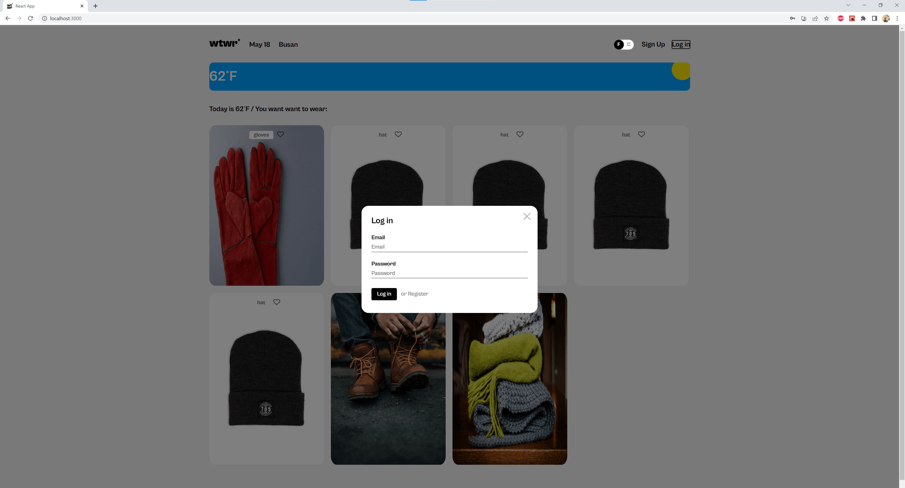
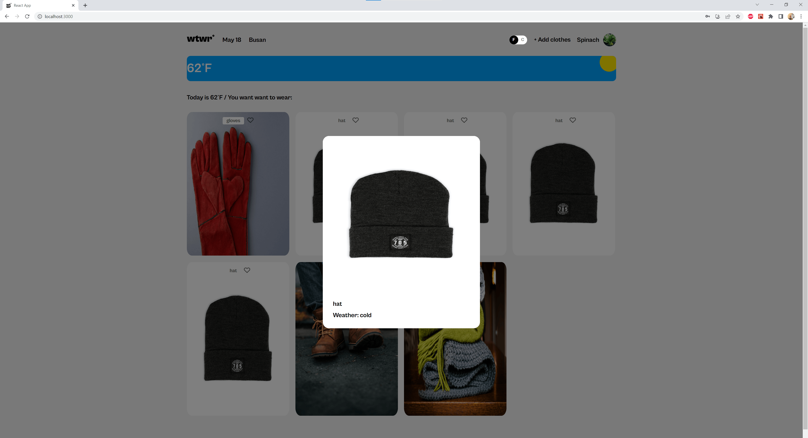

# WTWR (What to Wear?)

## About the project

This project is the fourteenth project in Practicum's Software Engineering course. It is the third iteration of a project that will span several sprints. In this project, I connect the backend portion I spent the previous two projects working on to this front end project. This project also has some added functionality in that now users are able to register and log in. When doing so, API requests are sent to the backend server. Users are now able to edit their profile data, add cards, delete cards, and like cards. When a user logs in, a JSON web token is created and stored in local storage so that if the user returns without logging out, the user will not have to log in again.

## Technologies and Techniques

- Semantic HTML
- CSS flexbox
- React Functional Components
- API requests
- Webpack

## Future Plans

I will continue to update this project over the coming sprints. Functionality to add clothing cards and possibly like clothing cards will be added. I would also like to add form validation and for the weather card to dynamically change depending on the weather.

## Preview

## Links

- [Backend Repo](https://github.com/skwisgaarr8-9/se_project_express)
- [Figma Design](https://www.figma.com/file/DTojSwldenF9UPKQZd6RRb/Sprint-10%3A-WTWR)
